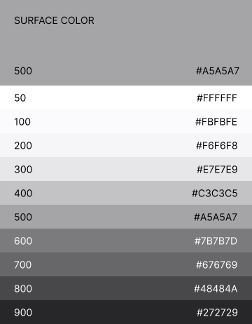
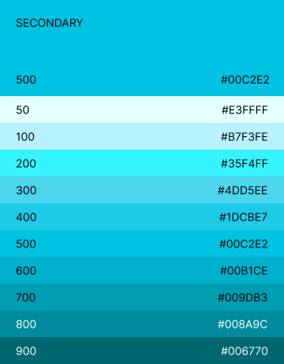
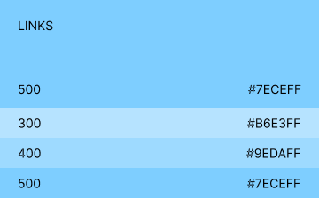

import { Card, CardGrid } from '@astrojs/starlight/components';

##### Read this guide if you need to customize components in your app.

EasyDev uses styled-components to create styles so that you can easily customize components.

//This template contains dark and light themes, but you can add your own theme.

## Colors

A palette of harmoniously matching colors has been developed especially for easydev. 
There are the following primary colors:
- Primary - for primary interface elements.
- Secondary - for secondary interface elements.
- Surface - for text color.
- Error - for alert the user about errors.
- Warning - for potentially dangerous actions or important messages.
- Success - for indicate the successful completion of user-triggered actions.
- Links - for links.
- Tretiary - for bright highlighting of elements.

Below is a palette of colors for dark and light themes.

##### Light theme

<div class='palette'>





</div>

##### Dark theme

<div class='palette'>








</div>

In easydev you can access color shade by color name and index, colors with larger index are darker. The default value is 500 as shown above.

<Card stagger>
theme.colors.surface['900']<br></br>theme.colors.primary['500']<br></br>theme.colors.warning['200']
</Card>


You can change the standard colors of a component either by styling the component itself (we'll talk about this later) or by using prop color.
Some components have prop _color_ and we can explicitly specify the color as shown in the examples.

Example:

```ts
export const Checkbox = ({ disabled, defaultChecked, color, ...props }: ControlBasePropsType) => {
  return (
    <CheckboxWrap disabled={disabled} color={color}>
      <StyledCheckbox type="checkbox" disabled={disabled} defaultChecked={defaultChecked} {...props} />
      <StyledCheckboxInner className="material-symbols-rounded check-mark">done</StyledCheckboxInner>
    </CheckboxWrap>
  );
};


<Checkbox checked={checked} color="red" readOnly {...args} />

<Checkbox checked={checked} color="#ab003c" readOnly {...args} />
```


## Themes

There are two standard light and dark themes with their own fields and properties, you can change them or add a new theme. 
To create a new theme, you need to create an object as in the example where you can specify your own styles: colors, spacing etc.To customize theme, pass theme override object to ThemeProvider theme prop.

Example:

```ts
const lightTheme = { type: 'light', colors: ... }
const darkTheme = { type: 'dark', ... }

const [theme, setTheme] = useState(lightTheme)

<ThemeProvider theme={theme}>
	<App>
		...
	</App>
</ThemeProvider>
```
In addition to creating your own themes, you can style ready-made components with using styled from styled-components. 
Example:
```ts
const StyledSelect = styled(Select)`
  color: ${({ theme }) => (theme.type === 'light' ? theme.colors.surface['700'] : theme.colors.surface['800'])};
  padding: 20px;
`

```


For more information about changing the theme, see the [styled components documentation](https://styled-components.com/docs/advanced)
