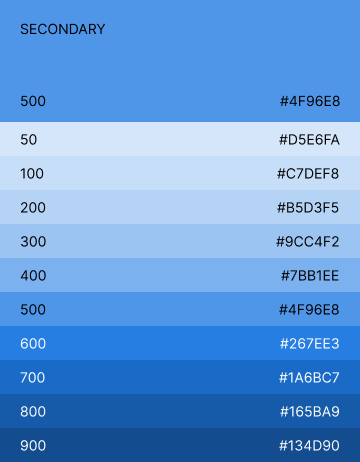

import { Card, CardGrid } from '@astrojs/starlight/components';

##### Read this guide if you need to customize components in your app.

EasyDev uses styled-components to create styles so that you can easily customize components.

//This template contains dark and light themes, but you can add your own theme.

## Colors


Some components have prop _color_ and we can explicitly specify the color as shown in the example.

Example:

```ts
export const Checkbox = ({ disabled, defaultChecked, color, ...props }: ControlBasePropsType) => {
  return (
    <CheckboxWrap disabled={disabled} color={color}>
      <StyledCheckbox type="checkbox" disabled={disabled} defaultChecked={defaultChecked} {...props} />
      <StyledCheckboxInner className="material-symbols-rounded check-mark">done</StyledCheckboxInner>
    </CheckboxWrap>
  );
};
```

```ts
<Checkbox checked={checked} color="red" readOnly {...args} />
```
In easydev you can access color shade by color name and index, colors with larger index are darker:

<Card stagger>
theme.colors.surface['900']<br></br>theme.colors.primary['500']<br></br>theme.colors.warning['200']
</Card>

Below is a palette for dark and light themes. The color palette has been specially designed for a harmonious combination of colors in the components. The default color is Primary.

<div class='palette'>



</div>


There are components with preset colors that can change depending on the chosen theme.
```ts
export const StyledDeleteButton = styled('button')`
  padding: 0;
  margin: 0;
  background-color: transparent;
  border: 0;
  color: ${({ theme }) => (theme.type === 'light' ? theme.colors.surface['900'] : theme.colors.surface['80'])};
  cursor: pointer;

  & > div {
    display: block;
  }
`;
```

Example:

```ts
<StyledDeleteButton type="button" {...props}>
  <div className="material-symbols-outlined">close</div>
</StyledDeleteButton>
```


## Themes

There are two standard light and dark themes with their own fields and properties, you can change them or add a new theme. To create a new theme, you need to create an object as in the example where you can specify your own styles: colors, spacing etc.To customize theme, pass theme override object to ThemeProvider theme prop.

Example:

```ts
const lightTheme = { type: 'light', colors: ... }
const darkTheme = { type: 'dark', ... }

const [theme, useTheme] = useState(lightTheme)

<ThemeProvider theme={theme}>
	<App>
		...
	</App>
</ThemeProvider>
```

For more information about changing the theme, see the [styled components documentation](https://styled-components.com/docs/advanced)
